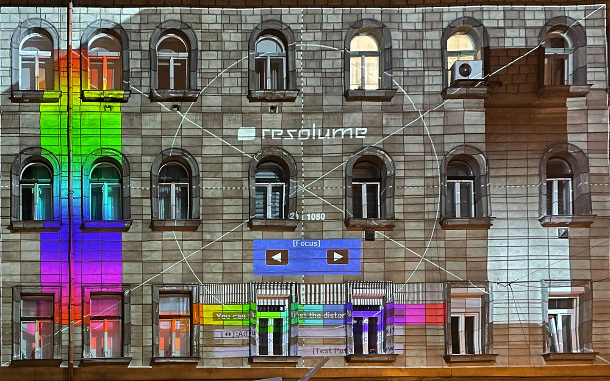

# adapter-snake

Snake, projected onto the side of a Budapest apartment block. Built for the opening of [Adaptér](https://adapterujbuda.hu/), Újbuda's creative technology centre.

## What it is

Adaptér opened at Bercsényi utca 10 with a two-day event called *Ajtónyitó*. One of the programme items was playing Snake on the wall of the building across the street.

A projector threw a 1440×900 canvas onto the facade. The building's windows sit inside the playfield as obstacles, so the snake has to weave between them. Crash into a window and the game ends.



## How the obstacles work

The window positions are hardcoded in `snake.js` as a 3×7 grid of rectangles, mostly 113×143 pixels:

```js
obstacles = [
  { x: 28,  y: 74,  width: 120, height: 143 },
  { x: 194, y: 74,  width: 113, height: 143 },
  ...
]
```

Aligning those by hand against a projected image is slow, so `obstacle_editor.html` does it visually: load the facade photo onto a canvas, drag and resize boxes over the windows, hit **Export Obstacles**, and paste the output into `snake.js`. `template_obstacles.json` holds the Bercsényi utca set.

Any other building works the same way. Swap `windows.jpg`, redraw the boxes, export.

## Run it

```bash
python3 -m http.server 8000
# game:   http://localhost:8000/snake.html
# editor: http://localhost:8000/obstacle_editor.html
```

Any key starts a round. Arrow keys or WASD to steer, in 20-pixel steps. `intro-placeholder.jpg` is the Adaptér title card shown before the game starts.

## Files

```
snake.html / snake.js                    the game
obstacle_editor.html / obstacle_editor.js  visual obstacle mapper
template_obstacles.json                  Bercsényi utca 10 window grid
windows.jpg                              facade photo, used for alignment
intro-placeholder.jpg                    Adaptér / Ajtónyitó title card
```

## Status

Vanilla canvas, no dependencies, no build. It ran for one night and I have not touched it since.

## License

MIT for the code. The Adaptér wordmark belongs to Adaptér.
